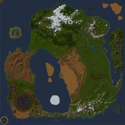

# Dereth Cartography

This reposity is just an archive of the C source code from David Simpson's _Dereth Cartography_ site which is no longer hosted at http://www.ugcs.caltech.edu/~dsimpson/.
On Tuesday, November 26th, 2019, I copied the five C source files form the most recent Internet Archive snapshot (https://web.archive.org/web/20120505235544/http://www.ugcs.caltech.edu/~dsimpson/) and made this repo for posterity.
All rights and credit go to David Simpson.

He notes:

> The following source code is provided "as is," so don't expect much help. It should be easy to understand though.
>
> Also, the source code provided below is meant to be executed from a command prompt, such as a DOS box or an xterm. They should compile using any standard C or C++ compiler on most platforms. They were all originally written in MS Visual C++, but I know that they compile just fine using gcc under Linux.
